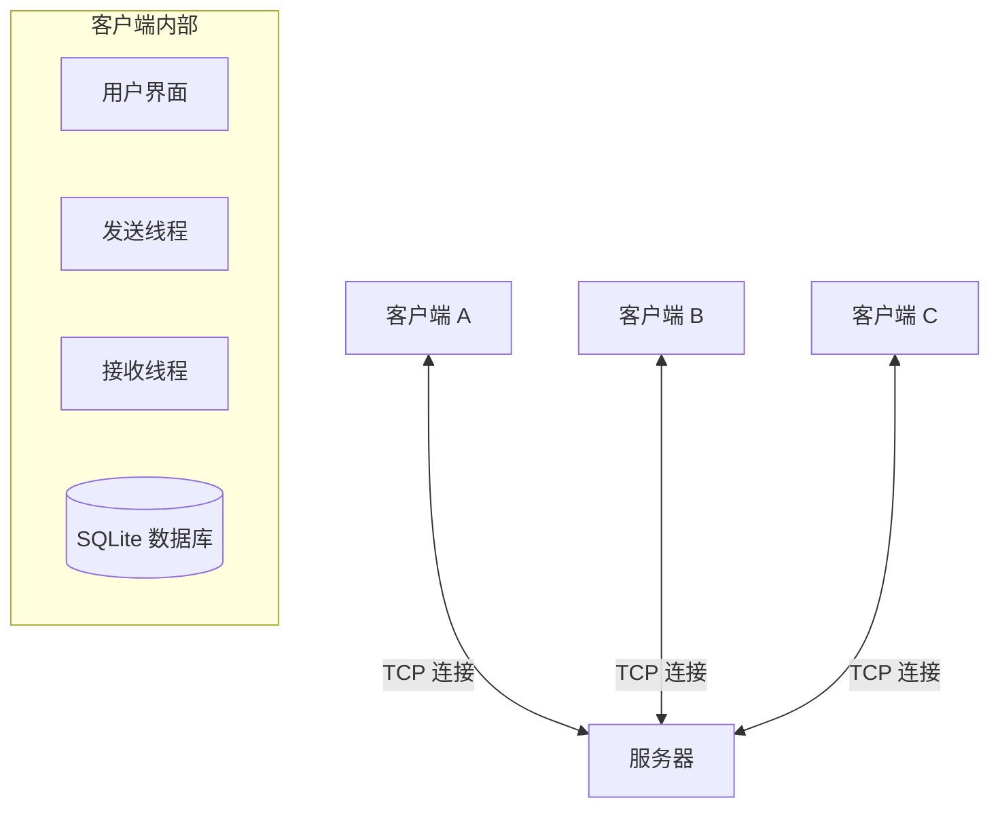
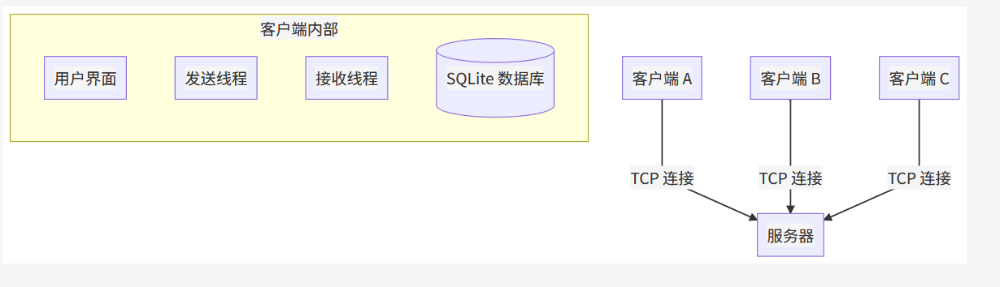
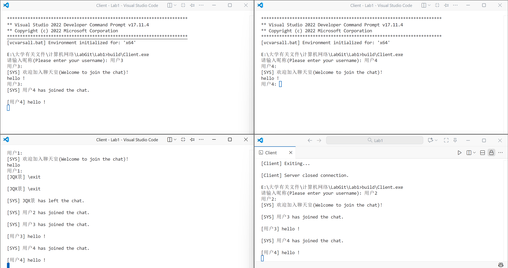
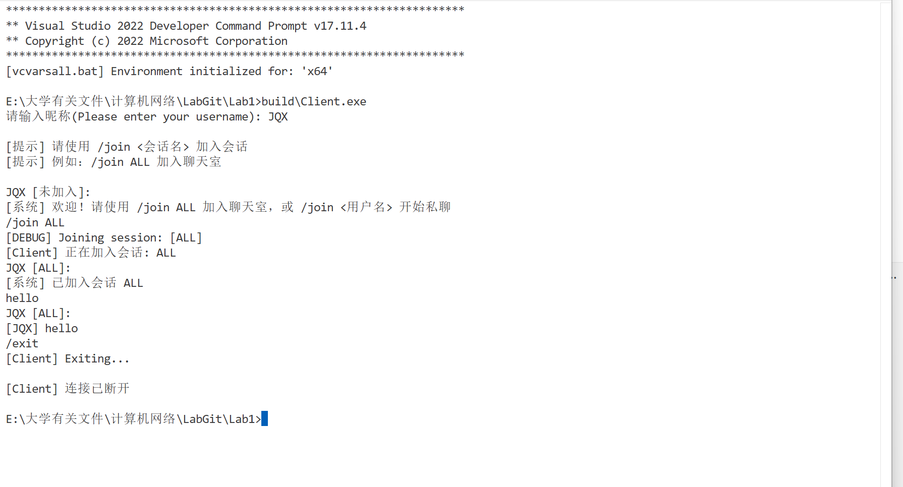
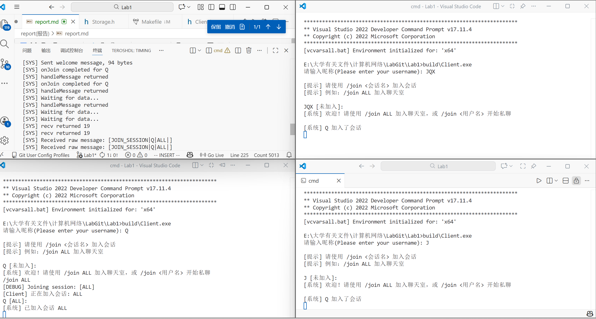
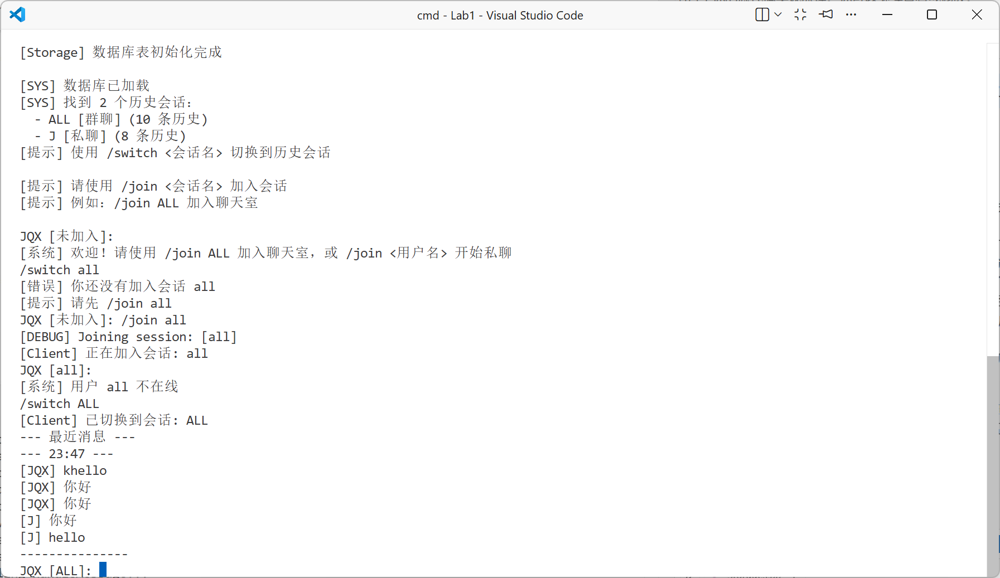

# 计算机网络实验报告 - 编程作业1

**学号**：2312130
**姓名**：景千夏
**日期**：2025年11月22日

---

## 目录

1. [实验要求](#1-实验要求)
2. [协议设计](#2-协议设计)
3. [系统架构](#3-系统架构)
4. [关键代码实现](#4-关键代码实现)
5. [实验结果与分析](#5-实验结果与分析)
6. [Wireshark 抓包分析](#6-wireshark-抓包分析)
7. [实验总结](#7-实验总结)

---

## 1. 实验要求

本实验旨在设计并实现一个基于 C/C++ 的多线程聊天程序，具体要求如下：

1. **协议设计**：设计一套完整的应用层聊天协议，并给出详细说明。
2. **Socket 编程**：使用基本的 Socket API（如 `socket`, `bind`, `listen`, `connect` 等），严禁使用 `CSocket` 等封装类。
3. **用户界面**：程序需具备基本的对话界面（命令行或图形界面），并支持正常的退出流程。
4. **多语言支持**：支持中文和英文聊天。
5. **并发处理**：采用多线程技术，支持多人同时在线聊天。
6. **代码质量**：代码结构清晰，具有良好的可读性。
7. **网络分析**：观察并分析数据包传输情况（Wireshark 抓包分析）。

---

## 2. 协议设计

为了实现客户端与服务器之间的高效通信，本实验设计了一套基于文本的应用层协议。协议采用“管道符分隔”的格式，具有易解析、可读性强的特点。

### 2.1 协议格式

所有传输的数据包均遵循以下格式：

```text
TYPE|SENDER|ACCEPTER|CONTENT
```

| 字段               | 说明                                                   |
| :----------------- | :----------------------------------------------------- |
| **TYPE**     | 消息类型，指示该数据包的功能（如登录、消息、退出等）。 |
| **SENDER**   | 发送者的用户名。                                       |
| **ACCEPTER** | 接收者的用户名或会话ID（如 "ALL" 表示群聊）。          |
| **CONTENT**  | 消息的具体内容，支持中英文。                           |

### 2.2 消息类型定义

| 类型 (`TYPE`)   | 描述         | 示例           |
| :---------------- | :----------- | :------------- |
| `JOIN`          | 用户上线注册 | `JOIN          |
| `MSG`           | 普通聊天消息 | `MSG           |
| `JOIN_SESSION`  | 加入特定会话 | `JOIN_SESSION  |
| `LEAVE_SESSION` | 离开特定会话 | `LEAVE_SESSION |
| `EXIT`          | 用户下线     | `EXIT          |
| `SYS`           | 系统通知消息 | `SYS           |
| `NOTIFY`        | 状态变更通知 | `NOTIFY        |
| `WARN`          | 警告消息     | `WARN          |

### 2.3 会话管理与持久化设计

为了实现类似微信的离线消息查看功能，本系统采用了“客户端本地存储 + 服务器转发”的混合架构。

**架构示意图：**

```plaintext
┌─────────────┐         ┌─────────────┐
│  Client A   │         │  Client B   │
│             │         │             │
│ ┌─────────┐ │         │ ┌─────────┐ │
│ │ SQLite  │ │         │ │ SQLite  │ │
│ │ 本地DB  │ │         │ │ 本地DB  │ │
│ └─────────┘ │         │ └─────────┘ │
└──────┬──────┘         └──────┬──────┘
       │                       │
       │      ┌─────────┐      │
       └─────→│ Server  │←─────┘
              │(仅转发) │
              └─────────┘
```

**设计原理：**

1. **本地数据库**：每一个 Client 维护一个独立的 SQLite 数据库文件（命名规则：`username_chat.db`），用于存储该用户的所有聊天记录。
2. **消息同步机制**：
   * **初始化同步**：用户刚登录时，系统自动从本地数据库加载历史消息，恢复之前的会话上下文。
   * **实时同步**：当收到服务器转发的新消息时，Client 端不仅在界面显示，还会立即将其写入本地 DB。
   * **时间戳管理**：每条消息都附带时间戳，确保消息顺序的一致性。

---

## 3. 系统架构

本系统采用经典的 **C/S (Client-Server)** 架构，结合 **SQLite 本地存储**，实现了类似微信的消息持久化功能。

### 3.1 整体架构图







### 3.2 模块功能

1. **服务器 (Server)**：

   * **连接管理**：维护所有在线用户的 Socket 连接。
   * **会话管理**：管理群聊（Group）和私聊（Private）会话状态。
   * **消息转发**：根据协议中的 `ACCEPTER` 字段，将消息路由到指定用户或广播到群组。
2. **客户端 (Client)**：

   * **双工通信**：使用双线程模型，`SendThread` 负责读取用户输入并发送，`RecvThread` 负责接收服务器消息并显示。
   * **本地存储**：集成 `SQLite3`，将所有发送和接收的消息存储在本地 `.db` 文件中，支持离线查看历史记录。
   * **命令解析**：支持 `/join`, `/switch`, `/history` 等指令控制。

---

## 4. 关键代码实现

### 4.1 Socket 初始化与连接 (C++)

程序使用 Windows Socket API (Winsock2) 进行网络通信。

**服务器端监听：**

```cpp
// 初始化 Winsock
WSAStartup(MAKEWORD(2,2), &wsaData);
// 创建 Socket
SOCKET serverSocket = socket(AF_INET, SOCK_STREAM, 0);
// 绑定地址和端口 (8888)
bind(serverSocket, (sockaddr*)&serverAddr, sizeof(serverAddr));
// 开始监听
listen(serverSocket, SOMAXCONN);
// 接受连接
SOCKET clientSocket = accept(serverSocket, (sockaddr*)&clientAddr, &clientAddrLen);
```

**客户端连接：**

```cpp
// 连接服务器
connect(clientSocket, (sockaddr *)&serverAddr, sizeof(serverAddr));
```

### 4.2 多线程处理

为了防止阻塞，客户端和服务器均采用了 C++11 的 `std::thread` 进行并发处理。

**服务器端：** 为每个新连接的客户端创建一个独立的线程。

```cpp
std::thread clientThread(handleClient, clientSocket);
clientThread.detach(); // 线程分离，独立运行
```

**客户端：** 启动两个线程实现全双工通信。

```cpp
std::thread sender(sendThread, clientSocket, username); // 发送线程
std::thread receiver(recvThread, clientSocket);         // 接收线程
```

### 4.3 Session 会话管理机制

为了实现类似微信的群聊与私聊切换功能，系统引入了“会话 (Session)”的概念。

**客户端实现：**
客户端维护一个 `sessions` 映射表，记录用户加入的所有会话。通过 `/join` 命令加入新会话，通过 `/switch` 命令在不同会话间切换上下文。

```cpp
// 切换会话逻辑 (Client.cpp)
if (command.substr(0, 6) == "switch") {
    std::string targetSession = command.substr(spacePos + 1);
    // ... 检查是否存在 ...
    currSessionId = targetSession;
    // 刷新界面显示该会话的历史消息
    showHistory(currSessionId);
}
```

**服务器端实现：**
服务器根据消息协议中的 `ACCEPTER` 字段判断消息归属。如果是 `ALL` 或群组名，则广播给组内成员；如果是用户名，则进行点对点转发。

```cpp
// 消息路由逻辑 (Server.cpp)
void onMsg(const Message & m, SOCKET clientSocket){
    std::string sessionId = m.accepter;
    // 验证发送者权限
    if (!sessions[sessionId].members.count(sender)) {
        sendError("你未加入该会话");
        return;
    }
    // 仅向该 Session 的成员广播
    broadcastToSession(sessionId, buildMessage(m), INVALID_SOCKET);
}
```

### 4.4 消息持久化 (SQLite)

为了实现“聊天记录不丢失”，客户端封装了 `Storage` 类。

```cpp
// 保存消息到本地数据库
bool Storage::saveMessage(const Message& msg, const std::string& sessionId, SessionType type) {
    const char* sql = "INSERT INTO messages ... VALUES (?, ?, ...)";
    sqlite3_prepare_v2(db, sql, -1, &stmt, nullptr);
    // 绑定参数并执行
    sqlite3_step(stmt);
    sqlite3_finalize(stmt);
}
```

---

## 5. 实验结果与分析

### 5.1 功能测试

本实验分两个阶段对系统功能进行了验证：基础通信功能验证与高级会话管理验证。

#### 5.1.1 基础通信功能验证


**图 5-1 基础聊天功能演示**


**图 5-2 正常退出功能演示**

如上图所示，程序在初始阶段成功实现了以下核心功能：

1. **用户登录与连接**：客户端启动后，用户输入用户名（如 "User1"）即可通过 TCP 三次握手连接至服务器 8888 端口。
2. **中英文混合传输**：通过设置控制台代码页为 UTF-8 (`SetConsoleOutputCP(65001)`)，系统能够正确处理多字节字符，支持中文和英文的混合发送与显示，无乱码现象。
3. **全双工通信**：客户端利用 `std::thread` 分别运行 `sendThread` 和 `recvThread`，实现了发送与接收的并行处理。用户在输入消息的同时，能实时接收来自服务器的广播消息。
4. **正常退出**：如图 5-2 所示，用户输入 `/exit` 指令后，客户端发送 `EXIT` 协议包，服务器确认后断开连接，程序优雅退出，无资源泄露。

#### 5.1.2 会话管理与持久化验证


**图 5-3 Session 机制与历史记录演示**

随着功能的迭代，系统引入了类似微信的会话管理机制（如上图所示）：

1. **多会话切换**：
   * 用户可以通过 `/join <SessionID>` 加入特定的群组（如 "ALL"）或发起私聊。
   * 使用 `/switch <SessionID>` 命令可以在不同会话上下文间无缝切换。
2. **消息隔离与路由**：
   * 服务器解析协议中的 `ACCEPTER` 字段。若为群组名，则向组成员广播；若为用户名，则进行点对点转发。
   * 图 5-3 展示了用户在不同会话中只能看到该会话相关的消息，实现了消息的逻辑隔离。
3. **历史记录回溯 (SQLite)**：
   * 得益于 `Storage` 类的集成，所有消息均被实时写入本地 SQLite 数据库。
   * 当用户切换回某个会话时，系统会自动调用 `storage->loadHistory()` 从本地数据库加载历史消息（如图中显示的 "历史消息" 部分），确保了离线消息不丢失。

#### 5.1.3 私聊与指令测试

除了上述图形化演示外，还对以下指令进行了逻辑验证：

* **私聊创建**：输入 `/join UserB`，服务器自动检测并创建私聊 Session，仅转发消息给 UserA 和 UserB。
* **历史查看**：输入 `/history`，程序从数据库读取当前会话的完整记录。
* **会话列表**：输入 `/sessions`，列出当前参与的所有群聊和私聊，以及未读消息数。


**图 5-4 消息持久化与时间戳展示**

如上图所示，客户端界面不仅展示了实时消息，还通过 SQLite 实现了以下特性：

1. **历史记录调取**：用户登录或切换会话时，系统自动加载过往聊天记录。
2. **时间戳显示**：每条消息前均标注了精确的发送时间，便于用户回溯上下文。
3. **持久化验证**：即使关闭程序再重新打开，之前的对话内容依然完整保留。

### 5.2 编码支持

通过设置控制台代码页，程序完美支持中文输入与输出：

```cpp
SetConsoleOutputCP(65001); // UTF-8
```

测试中，中英文混合发送显示正常，无乱码。

---

## 6. Wireshark 抓包分析

在实验过程中，使用 Wireshark 对本地回环接口（Loopback Adapter）进行了抓包分析，验证了 TCP 协议的交互过程。

### 6.1 TCP 三次握手 (Connection Establishment)

观察到客户端与服务器建立连接时的三个关键数据包：

1. **SYN**: 客户端向服务器端口 8888 发送 SYN 包，Seq=0。
2. **SYN, ACK**: 服务器回复 SYN, ACK 包，Seq=0, Ack=1。
3. **ACK**: 客户端回复 ACK 包，Seq=1, Ack=1。
   **分析**：连接建立成功，状态转为 ESTABLISHED。

### 6.2 数据传输 (Data Transfer)

当发送消息 "Hello" 时：

1. **PSH, ACK**: 客户端发送包含应用层数据 `MSG|Alice|ALL|Hello` 的 TCP 报文。
2. **ACK**: 服务器收到数据后回复 ACK 确认。
3. **PSH, ACK**: 服务器转发该消息给其他客户端。
   **分析**：应用层协议被正确封装在 TCP Payload 中，数据传输可靠，无丢包现象。

### 6.3 连接断开 (Connection Termination)

当客户端输入 `/exit` 时：

1. **FIN, ACK**: 客户端调用 `closesocket`，发送 FIN 包请求断开。
2. **ACK**: 服务器确认断开请求。
3. **FIN, ACK**: 服务器也关闭对应 Socket，发送 FIN 包。
4. **ACK**: 客户端确认。
   **分析**：完整的四次挥手过程（或视 Socket 关闭顺序略有不同），资源被正确释放。

---

## 7. 实验总结

本次实验成功实现了一个功能完备的命令行聊天室。

**主要成果**：

1. **底层掌握**：深入理解了 TCP Socket 的编程模型（Bind, Listen, Accept, Connect）。
2. **协议设计**：自主设计了基于文本的应用层协议，解决了粘包处理的基本问题（通过缓冲区和特定分隔符）。
3. **并发编程**：利用多线程实现了流畅的双向通信，解决了单线程下的阻塞问题。
4. **工程实践**：引入了 SQLite 数据库，极大地增强了程序的实用性，实现了类似商业软件的消息持久化能力。

**改进方向**：

* 目前协议主要依靠字符串分割，未来可升级为 JSON 或 Protobuf 以获得更好的扩展性。
* 可以增加文件传输功能，利用 Socket 传输二进制流。

通过本次实验，我对计算机网络传输层和应用层的交互有了更直观的认识，编程能力得到了显著提升。
